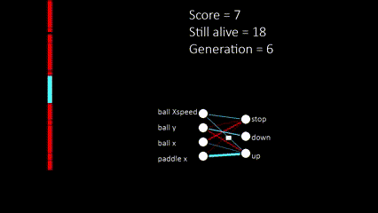
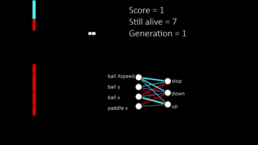

Genetic Algorithm Learns to Play Pong
=====================================

* [Code](myPongEv.py)
* [Project Description](#project-description)
* [What I Learned](#what-i-learned)
* [Proyect Highlights](#project-highlights)
* [Things to Improve](#things-to-improve)

Project Description
-------------------

This project explores the application of Genetic Algorithms (GAs) to teach a computer program to play Pong, a classic video game. The primary objective was to understand and implement GAs in a gaming context, focusing on evolving a population of neural network-based agents that learn and improve their ability to play Pong over generations. Unlike traditional machine learning models that learn from data, this project's agents learn through the process of natural selection, mutation, and crossover, inspired by biological evolution. Each player is initially "born" with completely random values - and overtime we select the fittest in each group to carry on to the next generation. 

Here is how the algorithm first starts, you can see the difference in the original weights, to those in the 6th generation:

You can find the full videos here:
 * [Video Start Generation](https://youtu.be/9RWZjcdEGFs)
 * [Video Evolved Generation](https://youtu.be/bkAmig85tY0)

What I Learned
--------------

*   **Genetic Algorithms**: Gained a comprehensive understanding of GAs, including their components (selection, crossover, mutation), and how they can be applied to optimize solutions for complex problems without explicit programming of the desired behavior.
*   **Neural Networks for Game Playing**: Learned to design and implement neural networks that serve as the decision-making brains of the agents. This involved understanding the inputs (game state) and outputs (agent actions) necessary for playing Pong.
*   **Simulation and Evaluation**: Developed skills in simulating game environments and evaluating agent performance. This included setting up a Pong game environment where agents could interact, receive feedback, and be scored based on their performance.
*   **Optimization Techniques**: Experimented with various GA parameters (mutation rate, selection strategy, population size) to find the most effective combination for rapid learning and improvement across generations.

* **Model Structure**: I also spent time displaying the model's internal structure to be able to easely visualize the changing weights. Of course, the most efficient model structure would be to just take into account the PaddleY and BallY positions, but I wanted to see how the model could "figure out" the correct strategy alone. 

Project Highlights
------------------

*   **Agent Evolution**: Successfully demonstrated the evolution of game-playing agents from initially random behavior to competently playing Pong, showcasing the power of genetic algorithms in learning and optimization.
*   **Dynamic Learning**: Highlighted the dynamic nature of learning through GAs, where agents adapt their strategies over generations, improving their gameplay without any direct instruction on how to play Pong.
*   **Performance Metrics**: Achieved significant improvement in agent performance, with the best agents from later generations consistently winning against the basic AI opponent provided with the Pong environment.

Things to Improve
-----------------

While the project was a success in demonstrating the application of genetic algorithms for game playing, there are several areas for future improvement:

*   **Enhanced Neural Network Architectures**: Explore more complex neural network architectures to improve the decision-making capabilities of the agents. This could include deeper networks or different types of layers to better process the game state. This would be better exemplified with a more complex game. 
*   **Diverse Population Strategies**: Implement more sophisticated strategies for maintaining genetic diversity within the population, such as introducing new, randomly generated agents in each generation to avoid local maxima.
*   **Advanced Evaluation Metrics**: Beyond winning or losing, incorporate additional metrics for evaluating agent performance, such as the number of volleys before losing or the ability to predict opponent moves.

This project was a fascinating exploration into the capabilities of genetic algorithms for problem-solving in dynamic environments. It provided valuable insights into both the strengths and limitations of GAs and opened up numerous avenues for further research and application in the field of AI and game development.